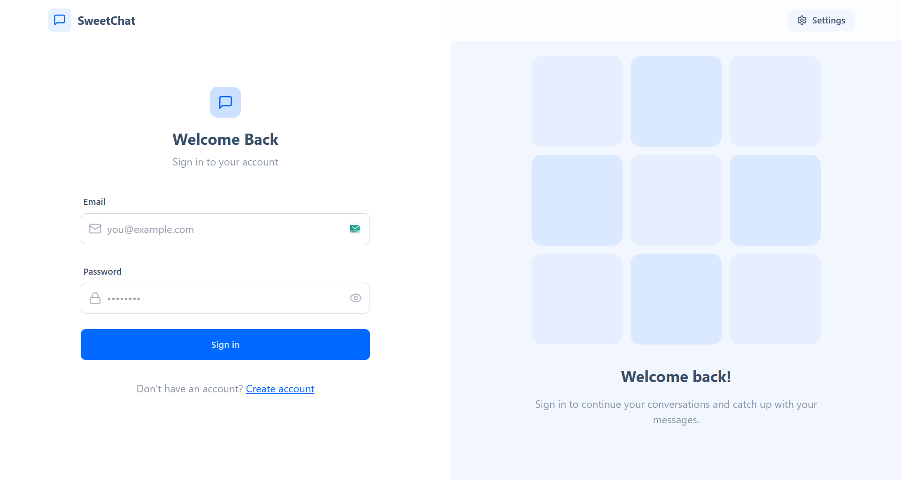
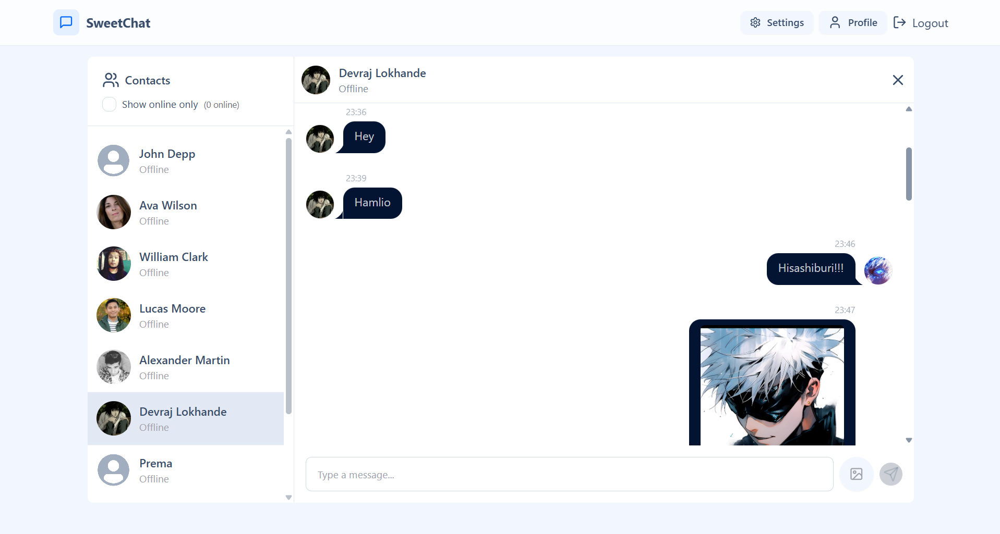
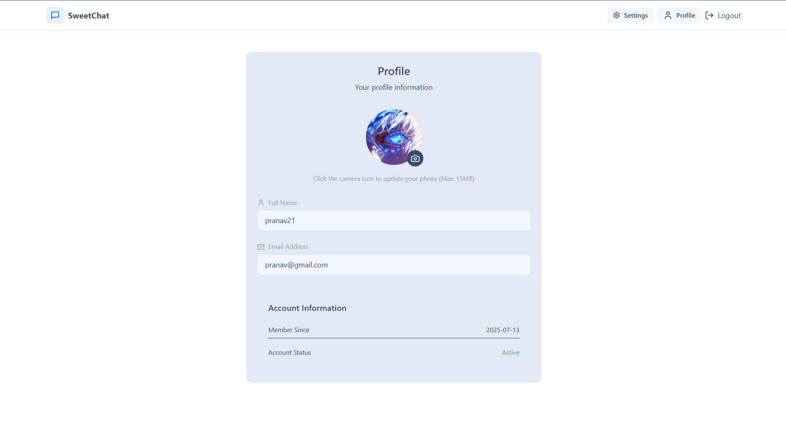
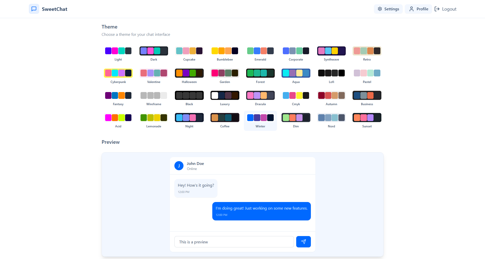

# 🍬 SweetChat - Real-time Messaging App


**SweetChat** is a modern, full-stack, real-time chat application designed for seamless and instant communication. It features a clean, responsive user interface with both light and dark modes, robust user authentication, and the ability to share images within conversations.

---

## 📸 PREVIEW






## ✨ Features

- **Real-time Messaging**: Instant message delivery and updates using **Socket.IO**.
- **Secure User Authentication**: JWT-based authentication with secure cookie storage.
- **Image Sharing**: Upload and share images in chats, powered by **Cloudinary**, with support for files up to 15MB.
- **Online Presence**: See which users are currently online.
- **Responsive Design**: A beautiful and functional interface on all devices, from mobile phones to desktops.
- **Light & Dark Themes**: Switch between themes to suit your preference.
- **User-Friendly Notifications**: Interactive toast notifications for a better user experience.
- **Profile Customization**: Users can update their profile pictures.
- **Scalable Backend**: Built with Node.js and Express, following best practices for a scalable and maintainable architecture.
- **Modern Frontend**: Developed with React and Zustand for efficient state management.

---

## 🛠️ Tech Stack

| Category      | Technologies                                                                                             |
|---------------|----------------------------------------------------------------------------------------------------------|
| **Frontend**  | `React.js`, `Zustand`, `React Router`, `TailwindCSS`, `DaisyUI`, `Axios`, `Socket.io-client`, `Lucide-React` |
| **Backend**   | `Node.js`, `Express.js`, `MongoDB`, `Mongoose`, `Socket.IO`, `JWT`, `Bcrypt.js`, `Cloudinary`, `Cookie-parser` |
| **Dev Tools** | `Vite`, `Nodemon`, `ESLint`                                                                              |

---

## 🚀 Getting Started

Follow these instructions to get a copy of the project up and running on your local machine for development and testing purposes.

### Prerequisites

- [Node.js](https://nodejs.org/en/) (v18 or later)
- [npm](https://www.npmjs.com/)
- [MongoDB](https://www.mongodb.com/try/download/community) instance (local or cloud-based like MongoDB Atlas)

### Installation & Setup

1.  **Clone the repository:**
    ```sh
    git clone https://github.com/your-username/sweetchat-2.git
    cd sweetchat-2
    ```

2.  **Install dependencies for the entire project:**
    This command will install dependencies for both the root, `backend`, and `frontend` directories.
    ```sh
    npm install
    ```

3.  **Set up environment variables:**
    Create a `.env` file in the `backend` directory and add the following variables. You can use the `.env.example` as a template.

    `backend/.env`:
    ```env
    PORT=5001
    MONGODB_URI=your_mongodb_connection_string
    JWT_SECRET=your_jwt_secret_key

    # Cloudinary Credentials
    CLOUDINARY_CLOUD_NAME=your_cloudinary_cloud_name
    CLOUDINARY_API_KEY=your_cloudinary_api_key
    CLOUDINARY_API_SECRET=your_cloudinary_api_secret
    ```

### Running the Application

You can run the frontend and backend servers concurrently in separate terminals.

1.  **Run the backend server:**
    ```sh
    npm run dev --prefix backend
    ```
    The backend will be running on `http://localhost:5001`.

2.  **Run the frontend development server:**
    ```sh
    npm run dev --prefix frontend
    ```
    The frontend will be available at `http://localhost:5173`.

---

## 📁 Project Structure

The project is organized into two main folders: `frontend` and `backend`.

```
.
├── backend/
│   ├── src/
│   │   ├── controllers/
│   │   ├── lib/
│   │   ├── middleware/
│   │   ├── models/
│   │   ├── routes/
│   │   └── index.js
│   └── package.json
│
├── frontend/
│   ├── src/
│   │   ├── components/
│   │   ├── lib/
│   │   ├── pages/
│   │   ├── store/
│   │   └── App.jsx
│   └── package.json
│
└── package.json
```

---

## 📄 License

This project is licensed under the ISC License. See the [LICENSE](./LICENSE) file for details.
